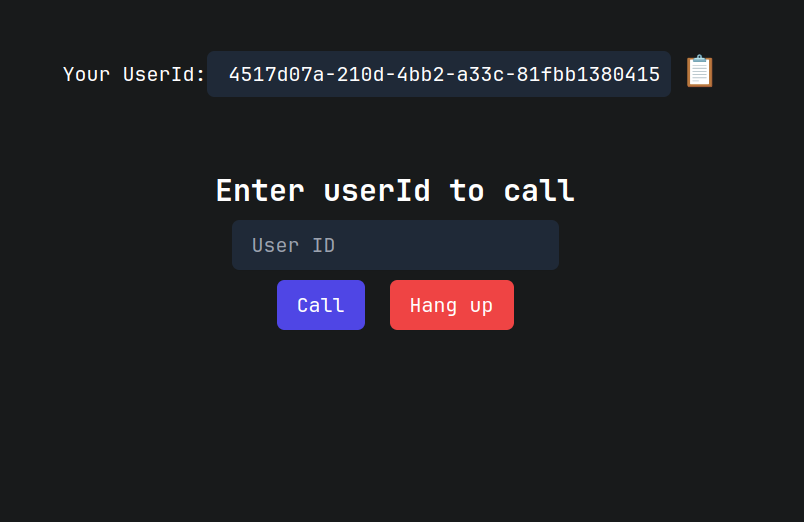
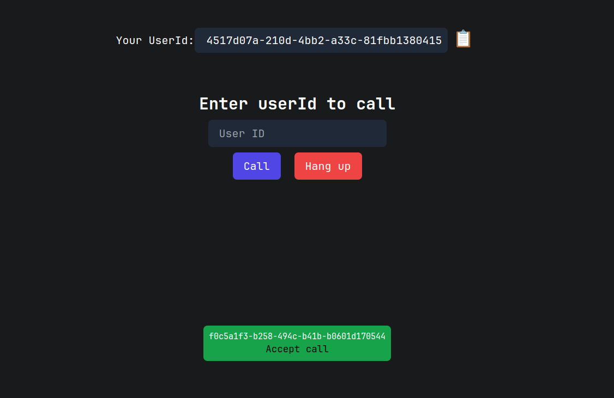
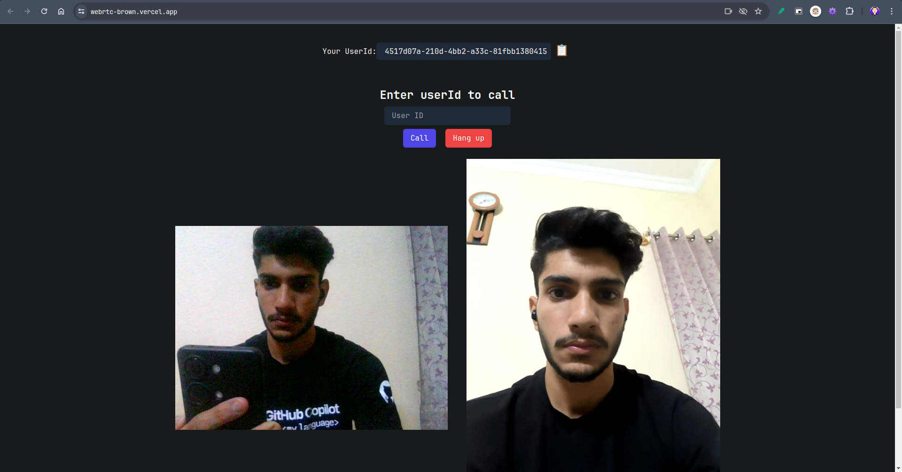

# WebRTC Video Call Application

This project is a simple video call application built using WebRTC. Users can initiate a video call with another user by entering the user ID. The frontend is developed using React, and the backend uses Node.js. No WebRTC libraries were used in this implementation built using only the **Raw WebRTC API**.

**Live Demo**: https://webrtc-brown.vercel.app

## Features

- **One-to-One Video Chat:** Users can have a seamless video chat with another user by entering their user ID.
- **Real-Time Communication:** The application leverages WebRTC for real-time video and audio communication.
- **Simple User Interface:** The UI is straightforward and user-friendly, allowing for easy initiation of video calls.

## Technologies Used

### Frontend

- **React:** For building the user interface.
- **Tailwind CSS:** For styling the application.
- **Vite:** For fast development and build processes.

### Backend

- **Node.js:** For the server environment.
- **Express.js:** For the server framework.
- **WebRTC:** For real-time video and audio communication.

## Installation

### Prerequisites

- **Node.js** (v14 or above)
- **npm** or **yarn**

### Backend Setup

1. **Clone the repository:**

   ```sh
   git clone https://github.com/yourusername/webrtc-video-call.git
   cd webrtc-video-call
   ```

2. **Navigate to the backend directory:**

   ```sh
   cd backend
   ```

3. **Install backend dependencies:**

   ```sh
   npm install
   ```

4. **Start the backend server:**

   ```sh
   npm run dev
   ```

### Frontend Setup

1. **Navigate to the frontend directory:**

   ```sh
   cd ../frontend
   ```

2. **Install frontend dependencies:**

   ```sh
   npm install
   ```

3. **Start the frontend development server:**

   ```sh
   npm run dev
   ```

## Usage

1. **Open your browser and navigate to:**

   ```sh
   http://localhost:5173
   ```

2. **Initiate a video call:**
   - Copy your user ID and share it with another user.
   - Enter the other user's ID in the input field and press Call to start the video call.

## Important

- If you want to access the video call from different devices in your local network then you must use ssl certificate in the frontend and backend as chrome does not allow media access without "https" and also make sure your backend also running on https.

## Screenshots

### Video Call Interface







## Contributing

1. Fork the repository
2. Create your feature branch (`git checkout -b feature/AmazingFeature`)
3. Commit your changes (`git commit -m 'Add some AmazingFeature'`)
4. Push to the branch (`git push origin feature/AmazingFeature`)
5. Open a Pull Request
